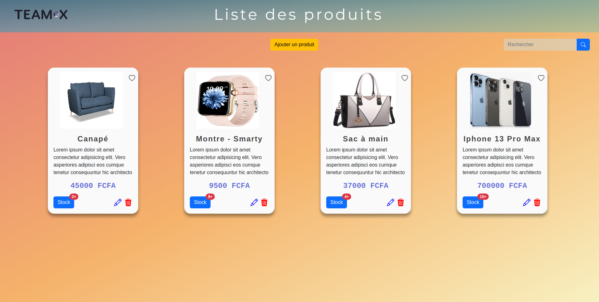
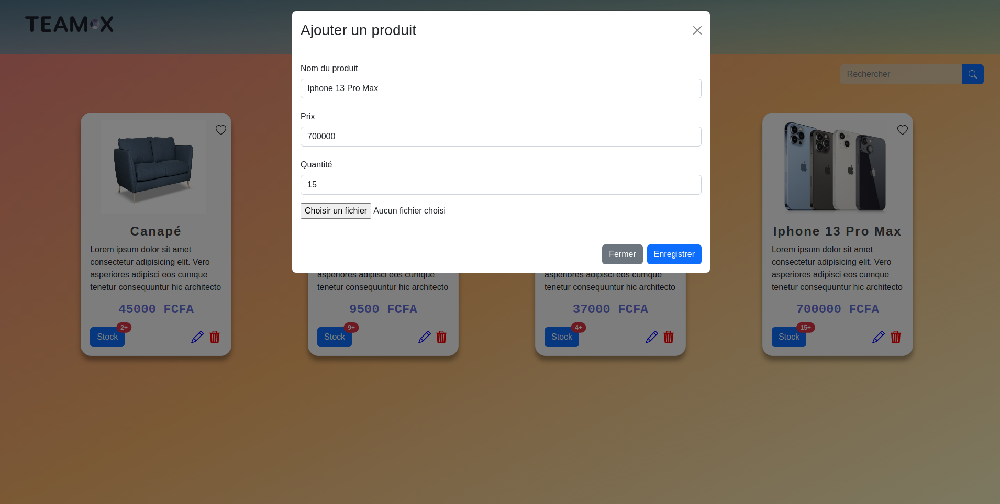
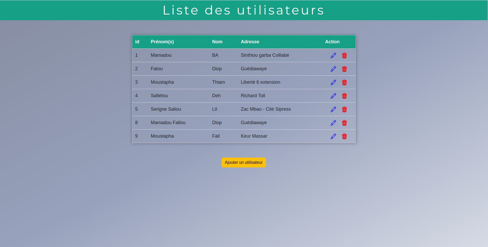
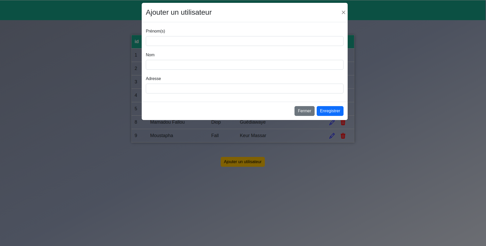
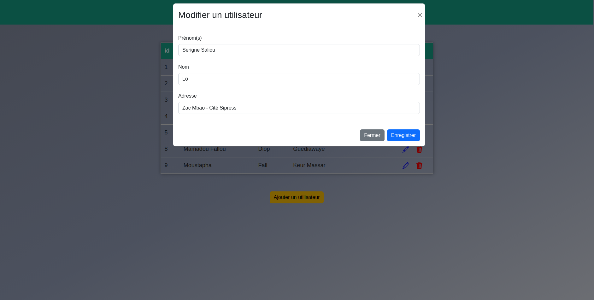

# MiniProjectAngularFrontend

<!-- 
-->
<!--    -->
<!--   -->
<!--  
 -->

[circleci-image]: https://img.shields.io/circleci/build/github/nestjs/nest/master?token=abc123def456
[circleci-url]: https://circleci.com/gh/nestjs/nest

# Projet 2 : Conception d'une application web avec Angular
Mise en place d'un serveur backend utilisant le framework NestJS (https://docs.nestjs.com/). On a utilisé MongoDB (https://www.mongodb.com/) comme base de données(BD). Le backend comporte deux modèles avec leurs contrôleurs et services :

  - Un modèle **user** qui permet de gérer les utilisateurs
  - Un modèle **product** qui permet de gérer les produits.
  
Le modèle **user** a les champs suivants : **_id**, **firstname**, **lastname**, **address**

Le modèle **produit** a les champs suivants : **_id**, **name**, **price**, **quantity**, **image**

## Résultats

### Product

 
 
 

### User

 
 
 

-----------

## Project Status 
      Complete 

